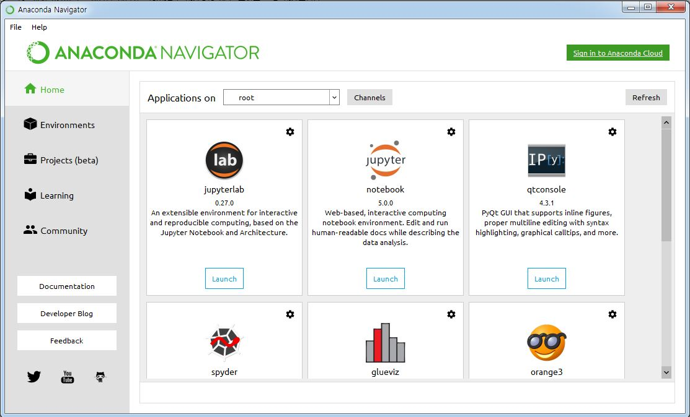

# 설치 관련 노트

### Anaconda 설치

[Anaconda 설치 링크](https://www.anaconda.com/download/) 다운받아서 설치하면 끝 !



### Jupyter Notebook 설치
Anaconda Navigator에서 Jupyter notebook의 install 버튼을 눌러주면 설치 끝
설치가 완료되면 Launch 버튼이 보이고 실행하면 아래와 같은 화면이 나온다


### 라이브러리 설치(필요 시)

#### xgboost

```
!pip install xgboost
```

#### Natural Language Tookit (NLTK)

오래걸릴 수 있음
```javascript
!pip install nltk

import nltk
nltk.download()
```