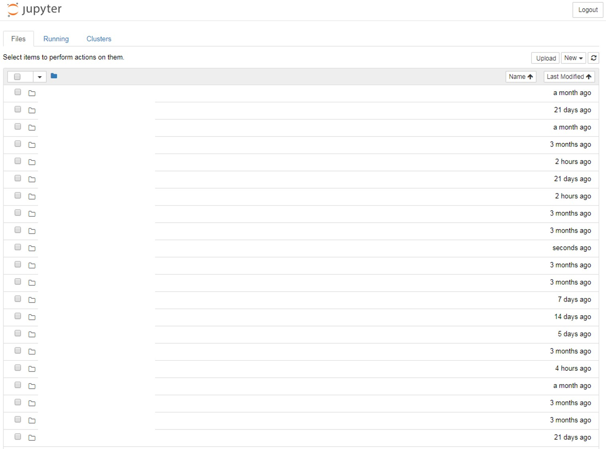

# 설치 관련 노트

### Anaconda 설치

[Anaconda 설치 링크](https://www.anaconda.com/download/) 다운받아서 설치하면 끝 !


### Jupyter Notebook 설치
Anaconda Navigator에서 Jupyter notebook의 install 버튼을 눌러주면 설치 끝
설치가 완료되면 Launch 버튼이 보이고 실행하면 아래와 같은 화면이 나온다



### 라이브러리 설치(필요 시)

#### xgboost


1) Jupyter를 이용한 설치
```
!pip install xgboost
```

2) Anaconda Navigator를 이용한 설치
Environments에서 libxgboost, py-xgboost를 설치하면 된다.

만약 xgboost가 정상적으로 설치되지 않을 경우
Anaconda Navigator > Environments에서
blaze 를 삭제(clear) 후 xgboost를 설치하니 잘됐음


#### Natural Language Tookit (NLTK)

오래걸릴 수 있음
```
!pip install nltk

import nltk
nltk.download()
```

#### Cython

```
!pip install Cython
```

#### gensim

```
!pip install --upgrade gensim
```